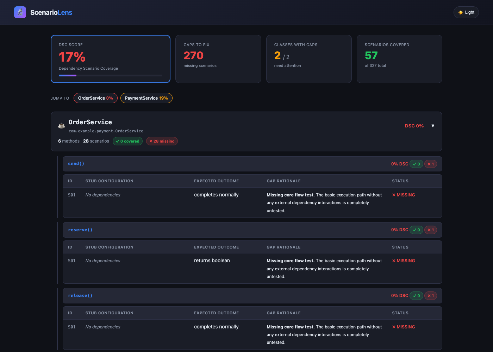
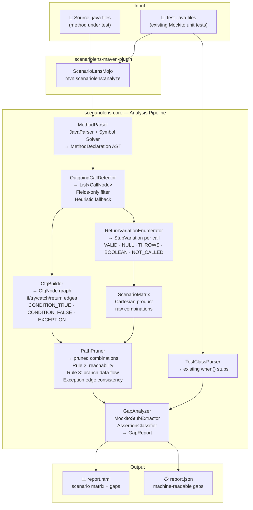

# 🔍 ScenarioLens

**Dependency Scenario Coverage (DSC) for Java**

[](https://github.com/scenariolens/scenariolens/actions)
[](https://opensource.org/licenses/Apache-2.0)
[](https://search.maven.org/artifact/io.scenariolens/scenariolens-maven-plugin)
[](https://openjdk.java.net/)

> **The missing dimension in Java test quality.** Stop guessing if your mocks cover what really happens in production.

---

## 🛑 Why ScenarioLens?

As senior engineers, we've all been there. Your PR has 100% line and branch coverage. The CI pipeline is glowing green. Then production falls over because a downstream payment service returned an unexpected `null` while your database transaction was quietly rolling back.

A test suite can easily achieve **100% branch coverage** while missing entire combinations of dependency behaviors. 

Your existing tools have a blind spot:
- **JaCoCo** tells you what code ran.
- **SonarQube** tells you which branches executed.
- **PIT** tells you if your assertions are strong.
- ❌ **Nothing** tells you if you tested the right combinations of dependency states.

**ScenarioLens** fills this gap by statically analyzing your source code, discovering the combinations of real-world scenarios your dependencies can produce, and telling you exactly which ones you forgot to mock in your tests.

---

## ⚡ Quick Start

Drop the Maven plugin into your project and get a comprehensive gap report instantly. **Zero runtime overhead.**

**1. Add the plugin to your `pom.xml`:**
```xml
<plugin>
  <groupId>io.scenariolens</groupId>
  <artifactId>scenariolens-maven-plugin</artifactId>
  <version>0.1.0</version>
  <configuration>
    <!-- Target the package you want to analyze -->
    <targetPackage>com.example.payment</targetPackage>
    <!-- Fail the build if scenario coverage drops below 70% -->
    <minScenarioCoverage>70</minScenarioCoverage>
  </configuration>
</plugin>
```

**2. Run the analysis:**
```bash
mvn scenariolens:analyze -DtargetPackage=com.example.payment
```

**3. View your report:**
Open `target/scenariolens/report.html` in your browser.

---

## 📊 Actionable Gap Reports

ScenarioLens analyzes your code at rest and categorizes coverage gaps by confidence tier so you know exactly what to fix first.

<p align="center">
  
  <br>
  <em>Authentic gap analysis report generated from the <strong>PaymentService</strong> example repository.</em>
</p>

### Example Output Snippet
```
[AUTO-VALIDATED] MISSING — order status CANCELLED
  Stub:     orderRepository returns Order(CANCELLED)
  Expected: InvalidStateException thrown
  Risk:     HIGH — exception path never tested

[BOUNDARY] VALIDATE — amount at refund threshold
  Stub:     configService.getThreshold() returns X
  Scenarios: amount = X-1, amount = X, amount = X+1
  Action:   confirm expected branch for each

[INFO] MANUAL — arithmetic correctness
  Location: line 42, refundAmount calculation
  Issue:    tool cannot verify operator correctness statically
```

---

## ⚙️ How It Works (Pure Static Analysis)

ScenarioLens doesn't spin up your Spring context or instrument your bytecode. It is **pure static analysis** that adds near-zero overhead to your pipeline (typically < 750ms).

1. **Parses AST:** Uses JavaParser to build a Control Flow Graph (CFG) of your method.
2. **Detects Dependencies:** Finds injected Spring Data repos, Feign clients, Kafka templates, etc.
3. **Prunes Impossible Paths:** Analyzes the CFG to eliminate mock combinations that can never coexist on the same execution path.
4. **Scans Existing Tests:** Extracts your existing `when/thenReturn` Mockito stubs.
5. **Calculates DSC:** Compares what you *could* mock against what you *did* mock to calculate your Dependency Scenario Coverage (DSC).

<details>
<summary><b>Click to view Architecture Diagram</b></summary>


</details>

---

## 🔍 What It Catches That Other Tools Miss

| Gap | JaCoCo | SonarQube | PIT | ScenarioLens |
|-----|--------|-----------|-----|--------------|
| Missing scenario combinations | No | No | No | **Yes** |
| Enum value coverage gaps | No | No | No | **Yes** |
| Null return from dependency untested | No | No | No | **Yes** |
| Specific stub combinations missing | No | No | No | **Yes** |
| Weak assertions (`assertNotNull`) | No | No | Yes | **Yes** |
| Boundary off-by-one | No | No | Yes | **Yes** (hybrid mode) |
| Untested branches | No | Yes | Yes | **Yes** |

---

## FAQ / Known Limitations

**Why is my DSC score 0%?**
If your repository heavily relies on concrete dummy implementations or state-based fakes (e.g., `Spring Retry`, `Spring Cloud OpenFeign`) instead of Mockito, ScenarioLens will report 0% DSC. Phase 1 exclusively analyzes Mockito (`when/thenReturn`) stubs. Support for state-based fakes is actively planned for [Phase 5](ROADMAP.md#phase-5--concrete-fake--dummy-resolution) to ensure teams using this best practice are accurately scored.

## 🎯 Who is this for?

- **Senior Engineers / Tech Leads:** Ensure your team isn't shipping brittle code masked by high line-coverage metrics.
- **QA & Reliability Engineers:** Discover edge cases before they turn into P1 incidents.
- **AI Coding Agents:** General-purpose AI agents struggle to know *what* tests to write. Provide them with `target/scenariolens/report.json` and ask them to close the coverage gaps autonomously.

### Give Your AI Agents a Map
It works today with any shell-capable agent (Claude, Gemini, Copilot):
> *"Run the ScenarioLens Maven plugin. Read `target/scenariolens/report.json`, review the missing scenarios, and generate the missing Mockito tests until DSC is above 80%."*

---

## 🗺️ Roadmap

Phase 1 is battle-tested and stable. We are actively expanding the ecosystem.

- [x] **Phase 1:** AST Extraction, CFG construction, Mockito stub extraction, HTML/JSON reports.
- [ ] **Phase 2 (Hybrid Boundary Resolution):** Purity gate checks, literal boundary extraction without test execution, config `@Value` parsing.
- [ ] **Phase 3 (Ecosystem Expansion):** Native Gradle plugin, WireMock stub extraction, SonarQube generic XML output, LCOV support.
- [ ] **Phase 4 (Advanced Analysis):** Multi-method flow tracing, intelligent numeric boundary inference.

See the full [ROADMAP.md](ROADMAP.md) for details.

---

## 🤝 Contributing

We welcome contributions! Phase 1 is complete and the core architecture is stable. Check out the issues tab or [ROADMAP.md](ROADMAP.md) for prioritized features.

Please read our [CONTRIBUTING.md](CONTRIBUTING.md) for details on:
- Building from source (`mvn install -DskipTests`)
- Running the test suite (`mvn clean test`)
- Our strict pre-commit hook ensuring green tests before every commit.

---

## 📄 License

ScenarioLens is open source under the [Apache 2.0 License](LICENSE).
