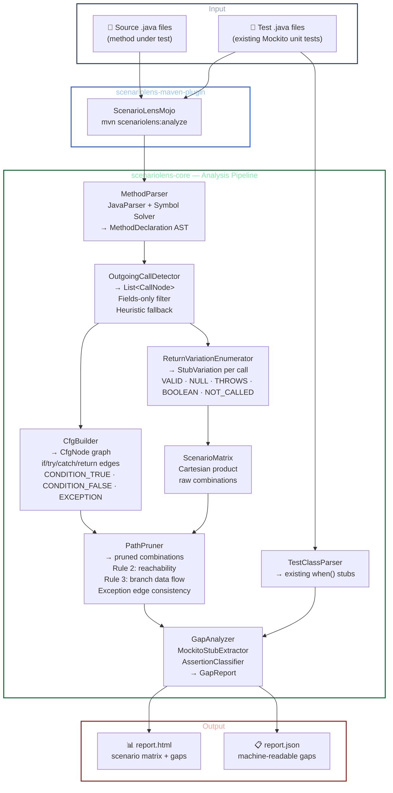

# ScenarioLens

> The missing dimension in Java test quality measurement.

**JaCoCo** tells you what code ran.
**SonarQube** tells you which branches executed.
**PIT** tells you if your assertions are strong.
**ScenarioLens** tells you if you tested the right scenarios.

---

## The Problem

A test suite can achieve 100% branch coverage while missing entire combinations of dependency behaviors. Consider a method that calls an order repository and a payment client — JaCoCo and SonarQube cannot tell you that you never tested what happens when the order is CANCELLED and the payment client times out simultaneously. ScenarioLens can.

---

## How It Works

ScenarioLens performs static analysis on your Java method and its unit tests to answer: *"Is the meaningful scenario space covered?"*

1. **Parses the method AST** using JavaParser to build a Control Flow Graph
2. **Identifies all outgoing calls** — injected interfaces, Spring Data repositories, Feign clients, KafkaTemplate
3. **Enumerates meaningful return variations** — enum values, null returns, exception paths, boolean outcomes
4. **Prunes impossible combinations** using CFG path analysis — if orderRepository returns null, paymentClient is never called, so scenarios stubbing both are eliminated
5. **Generates a scenario matrix** of all reachable input x stub combinations with expected outcomes
6. **Parses existing Mockito unit tests** and matches them against the matrix
7. **Reports gaps** with risk weighting and actionable recommendations

---

## Architecture



### Key Design Decisions

| Component | Decision | Rationale |
|---|---|---|
| `OutgoingCallDetector` | Field-only filter + heuristic fallback | Eliminates local variable calls (DTOs, params); works without full classpath |
| `CfgBuilder` | AST-driven, not bytecode | Works on source directly; no compilation required |
| `PathPruner` | 3-rule engine (reachability, exception edges, data flow) | Precisely models which stubs can coexist on the same execution path |
| `ReturnVariationEnumerator` | `NOT_CALLED` for all non-void types | Boolean and reference returns can both be unreachable depending on path |
| `ScenarioMatrix` | Cartesian product then prune (hard cap: 50 000 combinations; output cap: 500 scenarios per method) | Simpler than constraint solving; fast for real service methods; caps prevent heap exhaustion and report bloat on pathological inputs |

---

## Quick Demo

The [`examples/payment-service/`](examples/payment-service/) directory contains a realistic `PaymentService` with a deliberately incomplete test suite.

**Run it yourself:**
```bash
git clone https://github.com/scenariolens/scenariolens.git
cd scenariolens
mvn install -DskipTests -q
cd examples/payment-service
mvn scenariolens:analyze -DtargetPackage=com.example.payment
# → opens target/scenariolens/report.html
```

**Or view the pre-generated report:** [`docs/sample-report/report.html`](docs/sample-report/report.html)

---

## Development

### Build

```bash
git clone https://github.com/scenariolens/scenariolens.git
cd scenariolens
mvn install -DskipTests -q
```

Java 11+ and Maven 3.8+ are required.

### Running the Test Suite

Always run the full suite before committing. A pre-commit hook (`.git/hooks/pre-commit`) runs this automatically on every `git commit`, but you can invoke it manually at any time:

```bash
mvn clean test -pl scenariolens-core,scenariolens-maven-plugin
```

Expected output on a green run:

```
[INFO] Tests run: 18, Failures: 0, Errors: 0, Skipped: 0
[INFO] BUILD SUCCESS
```

| Suite | Class | Tests | Covers |
|---|---|---|---|
| Unit | `PathPrunerTest` | 3 | CFG pruning correctness |
| Unit | `EdgeCaseTest` | 5 | Edge cases: no-call, switch, duplicate indices, try/catch |
| Regression | `ScenarioMatrixRegressionTest` | 5 | `maxScenariosPerMethod` cap, `isTruncated()` semantics |
| Load | `ScenarioMatrixLoadTest` | 5 | 50k combinatorial guard, output cap, throughput < 5 s |

See [`CONTRIBUTING.md`](CONTRIBUTING.md) for full details on adding tests and making changes.

---

## AI Agent Workflow

LLM integration is intentionally not built into ScenarioLens. The JSON report is already LLM-ready. Any agent (Claude, Gemini, Copilot, etc.) can drive the iteration loop with this single instruction:

> Run the ScenarioLens Maven plugin which generates a coverage gap analysis report at `target/scenariolens/report.json`. Review the report and generate missing tests. Repeat until DSC score is above 80%.

This works today with any agent that can run shell commands and read files. No API keys, no provider lock-in, no maintenance burden.

---

## What It Catches That Other Tools Miss

| Gap | JaCoCo | SonarQube | PIT | ScenarioLens |
|-----|--------|-----------|-----|--------------|
| Missing scenario combinations | No | No | No | Yes |
| Enum value coverage gaps | No | No | No | Yes |
| Null return from dependency untested | No | No | No | Yes |
| Specific stub combinations missing | No | No | No | Yes |
| Weak assertions (assertNotNull) | No | No | Yes | Yes |
| Boundary off-by-one | No | No | Yes | Yes (hybrid mode) |
| Untested branches | No | Yes | Yes | Yes |

---

## Three-Tier Report

**AUTO-VALIDATED** — tool verifies presence and correctness, missing scenarios fail the build

**BOUNDARY** — tool generates scenarios, developer confirms stub values

**INFO** — tool cannot validate statically, surfaced for manual or LLM review

Example output:

```
[AUTO-VALIDATED] MISSING — order status CANCELLED
  Stub:     orderRepository returns Order(CANCELLED)
  Expected: InvalidStateException thrown
  Risk:     HIGH — exception path never tested

[BOUNDARY] VALIDATE — amount at refund threshold
  Stub:     configService.getThreshold() returns X
  Scenarios: amount = X-1, amount = X, amount = X+1
  Action:   confirm expected branch for each

[INFO] MANUAL — arithmetic correctness
  Location: line 42, refundAmount calculation
  Issue:    tool cannot verify operator correctness statically
  Suggested: assert exact computed refund amount, not just non-null
```

---

## Pipeline Impact

| Tool | Mechanism | Typical overhead |
|------|-----------|-----------------|
| JaCoCo | Bytecode instrumentation | 10-30 seconds |
| SonarQube | Static analysis | 1-3 minutes |
| ScenarioLens | Static analysis | 1-3 minutes |
| PIT | Test re-execution per mutant | 20-50x test suite time |

ScenarioLens never re-executes your tests. It adds near-zero perceived pipeline time.

---

## Use All Four — They Answer Different Questions

```
JaCoCo        Did this code execute?
SonarQube     Did execution go both ways at each branch?
ScenarioLens  Did you test the right scenario combinations?
PIT           Would your assertions catch a logic mutation?
```

No overlap in what they catch. Fully additive signal.

---

## Roadmap

See [`ROADMAP.md`](ROADMAP.md) for a detailed, prioritized backlog.

### Phase 1 — COMPLETE ✅
- JavaParser AST extraction and CFG construction
- Path pruning to eliminate impossible stub combinations
- Mockito stub extraction (when/thenReturn, when/thenThrow, doReturn)
- Assertion strength classification (STRONG vs WEAK)
- Maven plugin with HTML and JSON report output
- Configurable build failure threshold on scenario coverage percentage

### Phase 2 — Hybrid boundary resolution
- Purity gate check before any code execution
- Execute pure static methods to resolve literal boundary values
- Read @Value properties files for config-driven thresholds
- Extract boundaries from existing test Mockito stubs

### Phase 3 — Ecosystem expansion
- SonarQube generic coverage XML
- LCOV format output (GitHub Actions, VS Code gutters)
- WireMock stub extraction for IT/FT suite awareness
- Gradle plugin

### Phase 4 — Advanced analysis
- Multi-method flow tracing
- Numeric boundary generation without annotation
- Assertion causal correctness hints

---

## Academic Context

ScenarioLens introduces **Dependency Scenario Coverage (DSC)** — a new test adequacy criterion measuring what percentage of the feasible input x mock-response scenario space is exercised by an existing test suite, derived from static CFG analysis of the method under test.

This is distinct from all existing named criteria:

- **Line coverage** — measures execution
- **Branch coverage** — measures decision path traversal
- **Mutation score** — measures assertion strength
- **DSC** — measures scenario space completeness against integration boundaries

Adjacent academic work (MockMill 2026, TestGeneralizer 2026, SPARC 2025) validates the philosophy of scenario-based test adequacy but does not implement CFG-pruned combinatorial mock state analysis or gap reporting against existing test assets.

---

## Status

**Phase 1 complete — hardened and stress-tested.** Zero crashes across five corpora covering thousands of real-world methods:

| Corpus | Classes | Methods | Final Scenarios | Pruning | Notes |
|--------|---------|---------|-----------------|---------|-------|
| PaymentService (examples/) | 1 | 22 | 84 | 82–86% per method | Includes pathological edge-case methods |
| Spring PetClinic | — | 79 | 93 | up to 99.97% | Thin service layer; high prune rate expected |
| Baeldung Mockito module | — | 63 | 68 | 75–82% per method | Tutorial-grade code; solid baseline |
| Apache Kafka clients | 471 | 3 870 | — | 94–100% per method | No crashes; combinatorial guard activated on complex producers |
| Spring Framework transactions | 129 | 680 | — | 80–98% per method | No crashes; handles deep Spring proxy chains |

Processing time: under 750 ms per package for all corpora tested.

**Hardening highlights:**
- Combinatorial explosion guard: `ScenarioMatrix` aborts Cartesian expansion beyond 50 000 raw combinations and marks the method as `SKIPPED_COMBINATORIAL_LIMIT` in the report — prevents heap exhaustion on methods with 10+ injected dependencies.
- Bug-hunt pass (May 2026): fixed expected-outcome labels, gap-rationale phrasing, and occurrence indices for duplicate dependency calls.
- 8 unit tests pass (`mvn clean test`) including 5 dedicated edge-case tests.

Phase 2 and Ecosystem Expansion planning is in progress.

Website: https://scenariolens.io

---

## Performance & Known Limitations

Methods with extremely high cyclomatic complexity — 10+ outgoing calls each with independent return variations — can produce a large number of feasible scenarios even after path pruning. ScenarioLens applies two guards:

| Guard | Threshold | Behaviour |
|---|---|---|
| Combinatorial expansion cap | 50 000 raw combinations | Method is skipped entirely (`SKIPPED_COMBINATORIAL_LIMIT`) |
| Per-method scenario output cap | 500 pruned scenarios | Rows beyond the cap are silently dropped; a `[WARNING]` is logged |

The 514-scenario outlier observed during Kafka clients stress-testing is a real example of the second guard triggering. Without the cap, such a method would produce a 514-row HTML table that is effectively unreadable.

**To raise or lower the output cap** add `<maxScenariosPerMethod>` to your plugin configuration:

```xml
<plugin>
  <groupId>io.scenariolens</groupId>
  <artifactId>scenariolens-maven-plugin</artifactId>
  <configuration>
    <targetPackage>com.example.payment</targetPackage>
    <maxScenariosPerMethod>200</maxScenariosPerMethod>
  </configuration>
</plugin>
```

Or pass it on the command line:

```bash
mvn scenariolens:analyze -DtargetPackage=com.example.payment -DmaxScenariosPerMethod=200
```

The default of **500** is intentionally generous. For day-to-day reporting 50–100 is usually more practical.

---

## Contributing

Phase 1 is complete and the core architecture is stable. We are focused on ecosystem expansion (SonarQube XML, LCOV, Gradle) and hybrid boundary resolution.

See [`CONTRIBUTING.md`](CONTRIBUTING.md) for:
- How to build and run the test suite
- The pre-commit hook that enforces green tests before every commit
- Commit conventions and PR process

Check [`ROADMAP.md`](ROADMAP.md) for prioritized features and open an issue to discuss before starting large work.

---

## License

Apache 2.0
