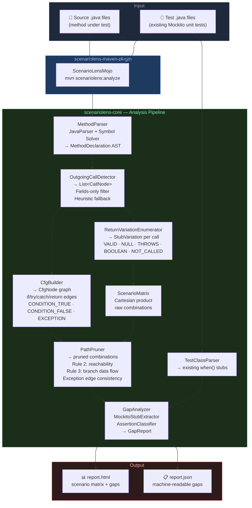

# ScenarioLens

> The missing dimension in Java test quality measurement.

**JaCoCo** tells you what code ran.
**SonarQube** tells you which branches executed.
**PIT** tells you if your assertions are strong.
**ScenarioLens** tells you if you tested the right scenarios.

---

## The Problem

A test suite can achieve 100% branch coverage while missing entire combinations of dependency behaviors. Consider a method that calls an order repository and a payment client — JaCoCo and SonarQube cannot tell you that you never tested what happens when the order is CANCELLED and the payment client times out simultaneously. ScenarioLens can.

---

## How It Works

ScenarioLens performs static analysis on your Java method and its unit tests to answer: *"Is the meaningful scenario space covered?"*

1. **Parses the method AST** using JavaParser to build a Control Flow Graph
2. **Identifies all outgoing calls** — injected interfaces, Spring Data repositories, Feign clients, KafkaTemplate
3. **Enumerates meaningful return variations** — enum values, null returns, exception paths, boolean outcomes
4. **Prunes impossible combinations** using CFG path analysis — if orderRepository returns null, paymentClient is never called, so scenarios stubbing both are eliminated
5. **Generates a scenario matrix** of all reachable input x stub combinations with expected outcomes
6. **Parses existing Mockito unit tests** and matches them against the matrix
7. **Reports gaps** with risk weighting and actionable recommendations

---

## Architecture



### Key Design Decisions

| Component | Decision | Rationale |
|---|---|---|
| `OutgoingCallDetector` | Field-only filter + heuristic fallback | Eliminates local variable calls (DTOs, params); works without full classpath |
| `CfgBuilder` | AST-driven, not bytecode | Works on source directly; no compilation required |
| `PathPruner` | 3-rule engine (reachability, exception edges, data flow) | Precisely models which stubs can coexist on the same execution path |
| `ReturnVariationEnumerator` | `NOT_CALLED` for all non-void types | Boolean and reference returns can both be unreachable depending on path |
| `ScenarioMatrix` | Cartesian product then prune | Simpler than constraint solving; fast enough for real service methods |

---

## Quick Demo

The [`examples/payment-service/`](examples/payment-service/) directory contains a realistic `PaymentService` with a deliberately incomplete test suite.

**Run it yourself:**
```bash
git clone https://github.com/scenariolens/scenariolens.git
cd scenariolens
mvn install -DskipTests -q
cd examples/payment-service
mvn scenariolens:analyze -DtargetPackage=com.example.payment
# → opens target/scenariolens/report.html
```

**Or view the pre-generated report:** [`docs/sample-report/report.html`](docs/sample-report/report.html)

---

## What It Catches That Other Tools Miss

| Gap | JaCoCo | SonarQube | PIT | ScenarioLens |
|-----|--------|-----------|-----|--------------|
| Missing scenario combinations | No | No | No | Yes |
| Enum value coverage gaps | No | No | No | Yes |
| Null return from dependency untested | No | No | No | Yes |
| Specific stub combinations missing | No | No | No | Yes |
| Weak assertions (assertNotNull) | No | No | Yes | Yes |
| Boundary off-by-one | No | No | Yes | Yes (hybrid mode) |
| Untested branches | No | Yes | Yes | Yes |

---

## Three-Tier Report

**AUTO-VALIDATED** — tool verifies presence and correctness, missing scenarios fail the build

**BOUNDARY** — tool generates scenarios, developer confirms stub values

**INFO** — tool cannot validate statically, surfaced for manual or LLM review

Example output:

```
[AUTO-VALIDATED] MISSING — order status CANCELLED
  Stub:     orderRepository returns Order(CANCELLED)
  Expected: InvalidStateException thrown
  Risk:     HIGH — exception path never tested

[BOUNDARY] VALIDATE — amount at refund threshold
  Stub:     configService.getThreshold() returns X
  Scenarios: amount = X-1, amount = X, amount = X+1
  Action:   confirm expected branch for each

[INFO] MANUAL — arithmetic correctness
  Location: line 42, refundAmount calculation
  Issue:    tool cannot verify operator correctness statically
  Suggested: assert exact computed refund amount, not just non-null
```

---

## Pipeline Impact

| Tool | Mechanism | Typical overhead |
|------|-----------|-----------------|
| JaCoCo | Bytecode instrumentation | 10-30 seconds |
| SonarQube | Static analysis | 1-3 minutes |
| ScenarioLens | Static analysis | 1-3 minutes |
| PIT | Test re-execution per mutant | 20-50x test suite time |

ScenarioLens never re-executes your tests. It adds near-zero perceived pipeline time.

---

## Use All Four — They Answer Different Questions

```
JaCoCo        Did this code execute?
SonarQube     Did execution go both ways at each branch?
ScenarioLens  Did you test the right scenario combinations?
PIT           Would your assertions catch a logic mutation?
```

No overlap in what they catch. Fully additive signal.

---

## Roadmap

### Phase 1 — Scenario matrix generation and gap analysis

- JavaParser AST extraction and CFG construction
- Path pruning to eliminate impossible stub combinations
- Enum value expansion from return types
- Null return detection where no null guard exists
- Mockito stub extraction (when/thenReturn, when/thenThrow, doReturn)
- Assertion strength classification (STRONG vs WEAK)
- Maven plugin with HTML and JSON report output
- Configurable build failure threshold on scenario coverage percentage

### Phase 2 — LLM integration
- Structured JSON gap spec designed as LLM prompt input
- Auto-generate missing tests via Claude, GPT, or local Ollama
- Re-run gap analysis to verify generated tests cover intended scenarios
- Close the generation-verification loop no existing tool provides

### Phase 3 — Hybrid boundary resolution
- Purity gate check before any code execution
- Execute pure static methods to resolve literal boundary values
- Read @Value properties files for config-driven thresholds
- Generate value-1, value, value+1 scenarios at each detected boundary

### Phase 4 — Ecosystem expansion
- WireMock stub extraction for IT/FT suite awareness
- Feign client and RestTemplate outgoing call detection
- Gradle plugin
- SonarQube custom metric integration

---

## Academic Context

ScenarioLens introduces **Mock-Aware Combinatorial Dependency Coverage (MCDC2)** — a new test adequacy criterion measuring what percentage of the feasible input x mock-response scenario space is exercised by an existing test suite, derived from static CFG analysis of the method under test.

This is distinct from all existing named criteria:

- **Line coverage** — measures execution
- **Branch coverage** — measures decision path traversal
- **Mutation score** — measures assertion strength
- **MCDC2** — measures scenario space completeness against integration boundaries

Adjacent academic work (MockMill 2026, TestGeneralizer 2026, SPARC 2025) validates the philosophy of scenario-based test adequacy but does not implement CFG-pruned combinatorial mock state analysis or gap reporting against existing test assets.

---

## Status

**Phase 1 complete.** Stress-tested across three corpora with zero crashes:

| Corpus | Methods | Final Scenarios | Pruning |
|--------|---------|-----------------|---------|
| test-project (PaymentService) | 22 | 84 | 82–86% per method |
| Spring PetClinic | 79 | 93 | up to 99.97% |
| Baeldung Mockito module | 63 | 68 | 75–82% per method |

Processing time: under 750ms per package.

Phase 2 (LLM integration) planning in progress.

Website: https://scenariolens.io

---

## Contributing

Phase 1 architecture and design are being finalized. If you are interested in contributing, open an issue to discuss.

---

## License

Apache 2.0
